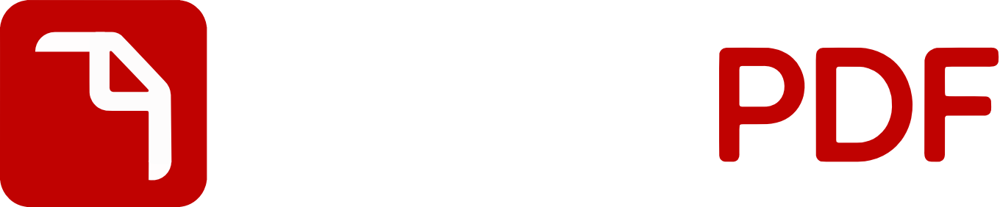
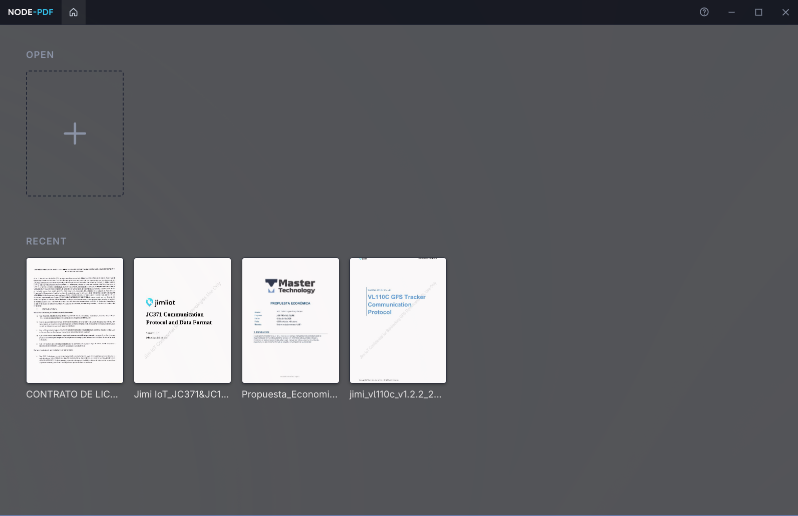
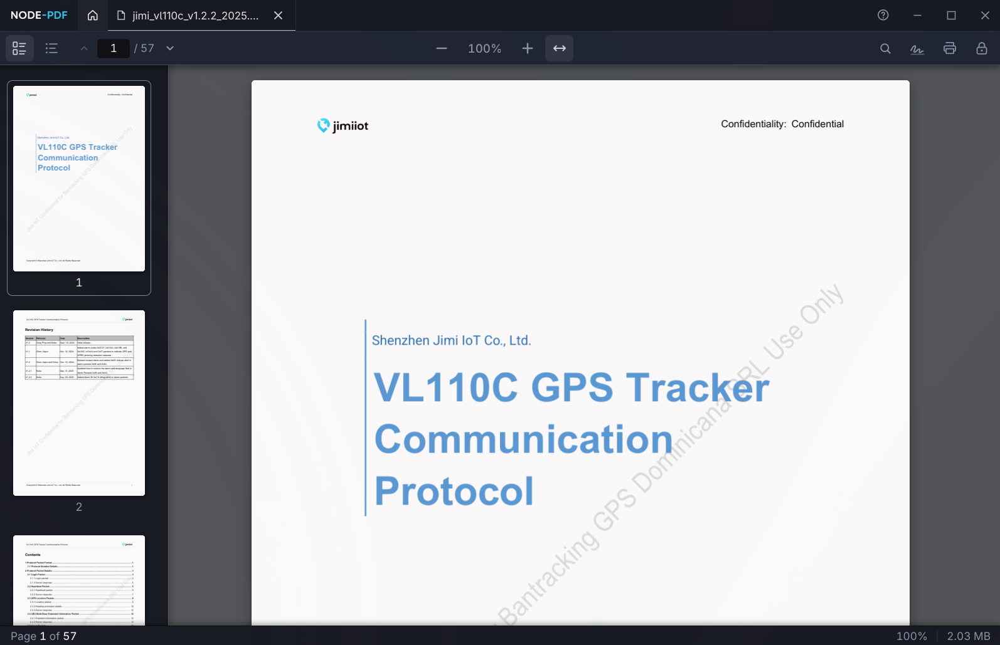
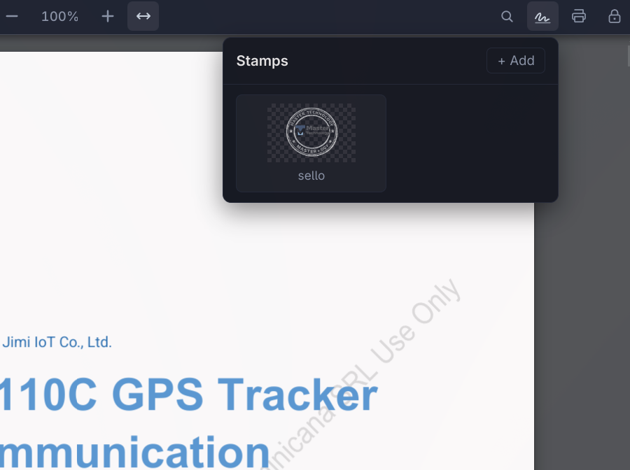
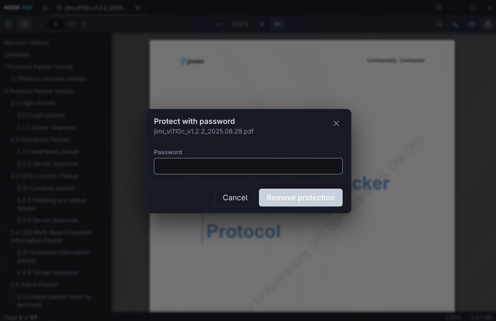

<div align="center">
  
</div>

<br />

<p align="center">
  A lightweight, fast desktop PDF viewer built with Electron and React.
  <br />
  Tabs, virtualized rendering, stamps, eSignatures, certificate-based signing (PAdES-LT), encrypted PDFs, full-text search, and more.
</p>

<p align="center">
  <a href="https://github.com/remdph/node-pdf/releases"></a>
  
  
</p>

<p align="center"><strong>Download the latest release</strong></p>

<!--
  Each button links to /releases/latest, which redirects to whatever the
  most recent release tag is. Filenames embed the version (e.g. NodePDF-
  0.3.0.Setup.exe) so we can't use /releases/latest/download/<file>
  shortcuts — the user lands on the release page and picks the asset
  matching the badge they clicked.
-->
<p align="center">
  <a href="https://github.com/remdph/node-pdf/releases/latest"></a>
  &nbsp;
  <a href="https://github.com/remdph/node-pdf/releases/latest"></a>
  &nbsp;
  <a href="https://github.com/remdph/node-pdf/releases/latest"></a>
  &nbsp;
  <a href="https://github.com/remdph/node-pdf/releases/latest"></a>
  &nbsp;
  <a href="https://aur.archlinux.org/packages/nodepdf-bin"></a>
  &nbsp;
  <a href="https://github.com/remdph/node-pdf/releases/latest"></a>
</p>

---

## Screenshots

<table>
  <tr>
    <td width="50%" valign="top">
      
      <p align="center"><sub>Home — open placeholder + recents carousel</sub></p>
    </td>
    <td width="50%" valign="top">
      
      <p align="center"><sub>Viewer — thumbnails, paginator, zoom, status bar</sub></p>
    </td>
  </tr>
  <tr>
    <td width="50%" valign="top">
      
      <p align="center"><sub>Stamps menu — pick, drag, resize, embed</sub></p>
    </td>
    <td width="50%" valign="top">
      
      <p align="center"><sub>Protect / unlock with outline panel open</sub></p>
    </td>
  </tr>
</table>

---

## Features

### Reading
- **Tabbed viewer** — open many PDFs side by side. Each tab keeps its scroll position, zoom and search across switches. Tabs size to the title text (short names get narrower tabs) and can be **dragged to reorder**.
- **Overflow tab menu** — when tabs no longer fit the titlebar, the rest fold into a dropdown (active tab stays visible).
- **Outline panel** — opens automatically for documents that have a table of contents; click any entry to jump.
- **Thumbnails sidebar** — virtualized previews with active-page tracking.
- **Internal link navigation** — clickable cross-references and TOC links scroll to their target page.
- **Recents** — visual carousel of recently opened files with cached thumbnails and right-click context menu.

### Navigation
- **Paginator** in the toolbar: first / prev / next / last page buttons, type-and-Enter page input, current/total indicator.
- **Zoom controls**: in / out / reset / fit-width, plus `Ctrl + wheel` over the document.
- **Status bar** at the bottom shows current page, total pages, zoom level and file size on disk.

### Search
- **Find-in-document** with multi-page text search (Enter to search, Enter again to advance, Shift+Enter to go back, Esc to close).
- **In-page highlighting** via the modern CSS Custom Highlight API — current match in orange, all matches in yellow, no DOM mutation, no interference with text selection.
- **Smart scrolling** — when the next match is on the same page and already visible, no extra scroll; otherwise the match is gently brought into view.

### Editing
- **Stamps** — add image stamps (PNG with transparency or JPEG), drag and resize on the page, then embed into the PDF.
- **Password protection** — set, change, or remove a password. Configurable permissions (print / copy / modify / annotate).
- **Open encrypted PDFs** — password prompt with retry-on-wrong-password and "cancel and retry later" state.
- **Copy selected text** — right-click any selection → Copy.

### Signatures (new in 0.2.0)
- **Visual eSignatures** — draw with mouse/touch, type with bundled OFL handwriting fonts (Caveat, Dancing Script, Great Vibes), or upload a PNG/JPG. Signatures are stored per-user and reusable across documents.
- **Cryptographic signing (PKCS#7 / CMS detached)** — sign PDFs with a real X.509 certificate. The signature is verifiable in Adobe Reader, Foxit and any RFC 5652 viewer.
- **Certificate management** — generate self-signed RSA-2048 certs in-app or import existing `.p12` / `.pfx` files (FIEL, FNMT, eIDAS-issued, etc.). Keys are stored as encrypted PKCS#12 — the password is required every time you sign.
- **Visible + cryptographic combined** — pick a stored visual signature as the on-page appearance of the cryptographic sig. The image and the crypto sig live in the same `/Sig` field.
- **Incremental updates** — every sign appends a new section to the PDF byte-perfect. Existing signatures stay valid through multiple sign rounds, and **encrypted PDFs can be signed** without removing their protection.
- **PAdES-T (trusted timestamps)** — optional RFC 3161 TSA round-trip embeds a timestamp token in the signature. Keeps the signature verifiable after the signer cert expires.
- **PAdES-LT (OCSP stapling)** — optional pre-fetch of the cert's OCSP response, embedded into the document's `/DSS` along with the full chain. Verifiers can confirm the cert wasn't revoked even years later, **without network access**.
- **Signature inspection** — opens any signed PDF (yours or third-party) and shows a three-dimensional verdict per signature:
  - **Integrity** — cryptographic verification of the CMS signed-attributes hash against the document byte-range. Detects tampering and incomplete signatures.
  - **Temporal validity** — cert was valid at signing time (LTV-aware: expired today but valid back then is rendered correctly).
  - **Trust** — chain verified against the bundled Mozilla CA root store (121 roots). Self-signed certs get a yellow badge; CA-issued ones get the "Trusted" badge.
  - **Revocation** — live OCSP responder check (only when the cert advertises an AIA URL).
- **Legacy format support** — reads `adbe.pkcs7.detached`, `adbe.pkcs7.sha1`, `ETSI.CAdES.detached`, and the pre-PKCS#7 `adbe.x509.rsa_sha1` (raw RSA + cert in `/Cert`).

### Updates (new in 0.3.0)
- **Windows / macOS** — silent auto-update via [`update-electron-app`](https://github.com/electron/update-electron-app), which talks to [update.electronjs.org](https://update.electronjs.org) (a free hosted proxy by the Electron team over this repo's GitHub Releases). New builds download in the background and a native "Restart to update" dialog appears when ready. Checks every hour.
- **Linux** — the same hosted service intentionally doesn't cover Linux (distros own their update flow). Instead the app polls the GitHub Releases API directly and surfaces a dismissable bottom-right banner with a "View release" link to the new release page. AUR users get updates automatically via `pacman -Syu` / their AUR helper; `.deb` / `.rpm` / AppImage users see the notification and download manually.

### Printing
- **Print dialog** with first-page preview and printer selection.

### Performance
- **Page virtualization** via `react-virtuoso` — large documents stay smooth.
- **Stale-while-revalidate snapshot cache** — pages keep their last rendered bitmap so zoom and scroll don't flash white.
- **Alive tabs** — inactive tabs are kept mounted but hidden, so switching is instant and never re-parses the PDF.

### UI
- **Frameless custom titlebar** with logo, home button, tabs, about (?), minimize / maximize / close.
- **Dark theme** by default with soft contrast accents — designed to feel like a native viewer surface.
- **Vector icons** and rem-based sizing — looks crisp on Hi-DPI displays.

---

## Install

Grab the right artifact for your OS from the [latest release](https://github.com/remdph/node-pdf/releases/latest):

| OS | Package |
| --- | --- |
| Windows | `NodePDF-*.Setup.exe` |
| macOS (Apple Silicon) | `NodePDF-*.dmg` |
| Debian / Ubuntu / Mint | `node-pdf_*_amd64.deb` |
| Fedora / openSUSE | `node-pdf-*.x86_64.rpm` |
| **Arch Linux** | `yay -S nodepdf-bin` (from the AUR) |
| Any Linux | `NodePDF-*-x86_64.AppImage` (chmod +x and run) |

## Quick start (development)

NodePDF requires **Node 22** (a `mise.toml` is included for [mise](https://mise.jdx.dev/) / asdf users) and **pnpm**.

```bash
pnpm install
pnpm dev
```

That launches the app in development mode (Vite + Electron with DevTools).

## Build & package

```bash
pnpm package    # build the app bundle (no installer)
pnpm make       # build platform-specific installers (deb/rpm/zip/squirrel/dmg)
```

## Tech stack

| Layer              | Library                                          |
| ------------------ | ------------------------------------------------ |
| Shell              | Electron 33 (frameless `BrowserWindow`)          |
| UI                 | React 18 + TypeScript (strict)                   |
| Bundling           | Vite + Electron Forge                            |
| PDF rendering      | `pdfjs-dist` 5.4 + `react-pdf` 10.4              |
| PDF writing        | `@cantoo/pdf-lib` (stamps, encryption, permissions, incremental update) |
| Cryptography       | `node-forge` (PKCS#12, X.509, PKCS#7/CMS, RFC 3161 TSA, OCSP) |
| Trust store        | Vendored Mozilla CA root bundle (curl.se cacert.pem) |
| Virtualization     | `react-virtuoso`                                 |
| Stamp drag/resize  | `react-rnd`                                      |
| State              | `zustand` with localStorage persistence          |

## Project layout

```
src/
  main/        Electron main process (windows, IPC handlers, app lifecycle)
    certs/        PKCS#12 generation + import + on-disk store
    pdf/          Shared embed/encryption helpers
    signatures/   Storage, protocol, inspect (CMS walker + chain verify),
                  sign-digital (placeholder + byte patch + CMS), TSA, OCSP, trust
    stamps/       Storage + custom `stamp://` protocol
  preload/     Context-isolated bridge that exposes a typed API to the renderer
  renderer/    React UI
    components/   PdfView, TitleBar, dialogs, stamps menu, signature editor,
                  signatures menu, signature panel, cert manager, digital sign…
    stores/       Zustand stores (tabs, stamps, signatures, certs, settings)
    styles/       global.css
  shared/      Types and IPC channel constants shared between main and renderer
```

## Roadmap (post-0.3.0)

- **OS trust store integration** — honor enterprise / government CAs the user has trusted at the OS level (currently only the bundled Mozilla list). Requires per-platform native bindings (Linux NSS, macOS Security, Windows WinTrust).
- **PAdES-LTA (archive timestamps)** — periodic timestamps over the `/DSS` to keep long-term signatures verifiable for decades.
- **Hardware token support** — sign with PKCS#11 tokens (YubiKey, smart cards, HSMs) for qualified eIDAS signatures.
- **Multi-signer workflows** — request signature from another party with field placeholders the second signer fills in.
- **Annotation editing** (highlights, comments) via pdfjs's `AnnotationEditorLayer`.
- **Form field filling**.
- **Bookmarks**.
- **Optional light theme**.

## License

MIT © Rafael Maldonado

## Support the project

If NodePDF saves you time, consider [buying me a coffee](https://www.buymeacoffee.com/remdph) — it helps keep development active.
